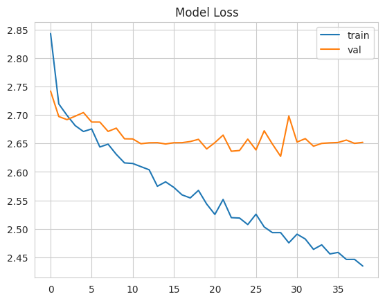
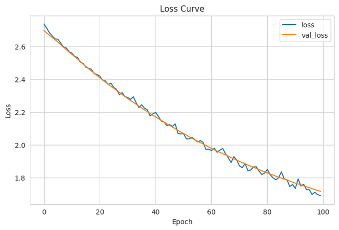

# Farm-Insects-Classification

## Objective
The goal of this project is to train a CNN model to identify harmful farm insects.

## Requirements
* tensorflow
* torch
* torchvision
* numpy
* pandas
* scikit-learn
* matplotlib
* seaborn
* dvc
* notebook
* python-box==6.0.2
* pyYAML
* tqdm
* joblib
* types-pyYAML
* scipy
* FastAPI
* reactpy
* split-folders

## Data
The data used for this project can be found on <a href="https://www.kaggle.com">kaggle</a>.
It is a dataset on farm insects which contains about 1700 images of 15 classes. You can download the 
dataset <a href="https://www.kaggle.com/datasets/tarundalal/dangerous-insects-dataset">here</a>.

## Model

The model that was used in trainining the images was a RESNET50 model.
The model training was done in both pytorch and tensorflow to compare how the model performed in each of these frameworks.

## Results
Comparing the loss curve, the pytorch version of the RESNET model had a smoother descent and didn't overfit the data like the tensor flow model did. Below are two graphs showing the loss for both models.

